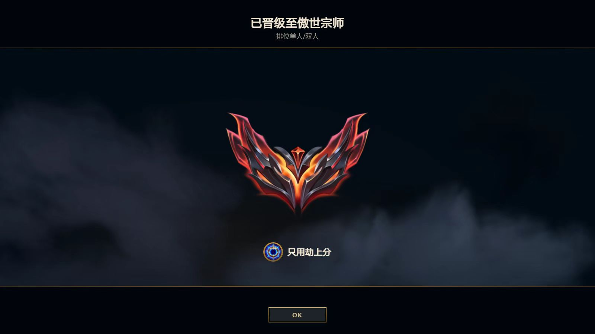

Hi there! I'm a incoming PhD student in HKUST(GZ), I'm interested in deep reinforcement learning (DRL). My recent research focuses on designing theoretically sound policy gradient algorithms and improving their generalization performance.

If you would like to have a discussion or collaborate with me, feel free to contact me through [zhengpengxie00@gmail.com](mailto:zhengpengxie00@gmail.com) or [zhengpengxie@hkust-gz.edu.cn](mailto:zhengpengxie@hkust-gz.edu.cn)!

<!-- I used to be a Grandmaster Zed player in League of Legends.
 -->

